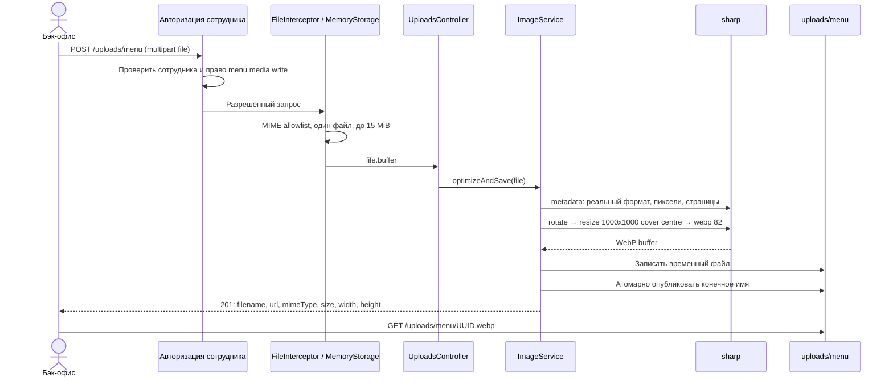

# ADR-008 — Оптимизация изображений блюд

## Статус и границы

Техническое решение по заданным владельцем параметрам. Дополнительные эксплуатационные решения ниже — предложения к реализации.
Документ подготовлен по локальному checkout ~/Projects/SHIK-ROLL-PLATFORM; соответствие checkout ветке main не проверялось. Исходники не изменялись.
Целевой путь в Obsidian: 02-Architecture-Decisions/ADR-008-Image-Optimization.md.
Решение принято владельцем и реализовано 2026-09-11: UploadsModule в services/backend, PR #38 → feature/timeweb-production-deploy. Уникальность ADR-008 в Vault проверена перед записью. Реализация отклоняется от опорного кода в одном пункте: вместо FileInterceptor + фильтра ошибок Multer применён собственный MenuFileInterceptor — NestJS 11 transformException конвертирует MulterError в BadRequest/PayloadTooLarge до exception filters.

## Контекст

В services/backend используются NestJS 11, Express adapter, pnpm и Node 22 Alpine в production.
В просмотренных src отсутствуют upload-модуль, Multer и настройка раздачи uploads. В package.json нет sharp.
MenuController уже содержит POST /menu-items и PATCH /menu-items/:id с JSON DTO.
CreateMenuItemDto/UpdateMenuItemDto не содержат imageUrl: нельзя обещать привязку результата к блюду без отдельной проверки Prisma-модели и контракта медиа.
В AuthModule реализована гостевая авторизация; найденные guards относятся к гостям, курьерам и кухне. Готовая авторизация сотрудников бэк-офиса не обнаружена.
Nginx уже имеет client_max_body_size 20M; этого достаточно для файла 15 MiB и multipart-заголовков.

## Решение

Создать UploadsModule со специализированным ImageService и отдельным UploadsController.
Сервис отвечает за проверку фактического формата, преобразование и сохранение. Контроллер задаёт multipart-контракт.
Pipe с побочным эффектом записи не выбирается: сервис проще вызывать и тестировать независимо от HTTP.

Поток: MemoryStorage → Express.Multer.File.buffer → sharp → WebP buffer → uploads/menu/<UUID v4>.webp.
Оригинал не сохраняется. Имя клиента, расширение и путь клиента никогда не участвуют в имени на диске.
UUID v4 генерируется встроенным node:crypto.randomUUID(); отдельный пакет uuid не нужен.

| Параметр | Значение |
| --- | --- |
| Multipart-поле | file, один файл |
| Допустимые MIME | image/jpeg, image/png, image/webp |
| Максимальный размер | 15 × 1024 × 1024 = 15 728 640 байт включительно |
| Формат результата | Только WebP |
| Размер результата | Ровно 1000 × 1000 px |
| Кадрирование | fit: 'cover', position: 'centre' |
| Качество | quality: 82 |
| Ориентация | rotate() без аргументов перед resize |
| Метаданные | Не вызывать keepMetadata/withMetadata/keepExif/withExif |
| Имя | UUID v4 + .webp |
| Хранилище | UPLOADS_ROOT/menu; локально UPLOADS_ROOT=.../services/backend/uploads |
| Публичный путь | /uploads/menu/<UUID>.webp |
| Целевой вес | 150–250 КБ, наблюдаемый ориентир, не обязательный диапазон |

Лимит «15 МБ» здесь явно трактуется как 15 MiB. Изменить на 15 000 000 только при отдельном согласовании контракта.
При фиксированных quality и разрешении гарантировать диапазон веса нельзя: простые картинки могут быть меньше, детализированные — больше.
Не добавлять цикл снижения качества и не увеличивать маленькие файлы искусственно.
Маленькие изображения увеличиваются до 1000 × 1000; withoutEnlargement запрещён, так как нарушает фиксированный размер.
PNG/WebP сохраняют прозрачность; фон принудительно не подставляется.

rotate() применяет EXIF-ориентацию к пикселям. Сброс остальных метаданных обеспечивает стандартное поведение sharp при выводе без методов сохранения метаданных.
См. [ориентация](https://sharp.pixelplumbing.com/api-operation/) и [вывод WebP и метаданные](https://sharp.pixelplumbing.com/api-output/).
Параметры cover/centre: [sharp resize](https://sharp.pixelplumbing.com/api-resize/).

## Схема вызовов



При внешнем API-префиксе /api Nginx преобразует /api/uploads/menu в backend /uploads/menu согласно существующему правилу.
Публичный URL статики не должен зависеть от рабочего каталога процесса или заголовка Host клиента.

## Валидация и ошибки

MIME в multipart контролирует клиент: проверять его allowlist недостаточно.
До преобразования sharp.metadata() должен распознать jpeg/png/webp; фактический формат должен соответствовать заявленному MIME.
SVG, GIF, HEIC, AVIF, PDF, TIFF и подмена расширения/Content-Type отклоняются.
Предлагаемый лимит декодирования — 40 000 000 пикселей, отдельно от ограничения сжатого файла.
Предлагаем отклонять многостраничные/анимированные файлы (pages > 1), чтобы результат не зависел от неявного выбора первого кадра.
Повреждённые и усечённые изображения отклоняются; оригинал не публикуется.

| Ситуация | HTTP |
| --- | --- |
| Нет файла, пустой файл, лишнее поле/файл | 400 |
| Файл больше лимита | 413 |
| Недопустимый MIME, фактический формат или их несовпадение | 415 |
| Ошибка декодирования, предел пикселей, анимация | 422 |
| Нет авторизации / нет права сотрудника | 401 / 403 |
| Перегрузка обработки | 503 |
| Ошибка записи | 500, без раскрытия пути и содержимого файла |

Сохранить формат ошибок API: statusCode, code, message. Ошибки Multer нормализовать фильтром загрузок; LIMIT_FILE_SIZE → 413, неожиданный файл/число частей → 400.
Лимит Multer задать MAX_IMAGE_BYTES + 1 и затем проверять buffer.length > MAX_IMAGE_BYTES в сервисе: это обеспечивает приём точной верхней границы даже при срабатывании Multer на достижении лимита. Покрыть граничными e2e-тестами.
Использование FileInterceptor и MemoryStorage: [NestJS upload](https://docs.nestjs.com/techniques/file-upload).

## Изменения package.json

Diff относительно просмотренного services/backend/package.json; диапазоны — предлагаемая база, перед установкой проверить advisories и совместимость. Lockfile обновляет pnpm, вручную его не редактировать.

```diff
--- a/services/backend/package.json
+++ b/services/backend/package.json
@@
     "ioredis": "^6.0.0",
+    "multer": "^2.0.2",
@@
-    "rxjs": "^7.8.2"
+    "rxjs": "^7.8.2",
+    "sharp": "^0.35.4"
@@
     "@types/jest": "^29.5.14",
+    "@types/express": "^5.0.0",
+    "@types/multer": "^2.0.0",
```

sharp содержит собственные TypeScript-типы. Не устанавливать @types/sharp.
Не копировать node_modules с macOS в Linux. Установку выполнить внутри production-образа; сохранить optional native dependencies под Linux musl.
Проверить, что NestJS platform-express использует исправленный Multer; прямая зависимость не гарантирует обновление вложенной версии.
При необходимости обновить согласованно NestJS-пакеты в пределах совместимого major.
[Установка sharp](https://sharp.pixelplumbing.com/install/).

## ImageService: опорная реализация

Новый файл services/backend/src/modules/uploads/image.service.ts.
Код ниже — проект реализации, ещё не компилировался и не проходил тесты в репозитории.

```ts
import {
  HttpException, Injectable, InternalServerErrorException,
  OnModuleInit, ServiceUnavailableException,
} from '@nestjs/common';
import { randomUUID } from 'node:crypto';
import { mkdir, writeFile, link, unlink } from 'node:fs/promises';
import { resolve, join } from 'node:path';
import sharp from 'sharp';

export const MAX_IMAGE_BYTES = 15 * 1024 * 1024;
export const IMAGE_MIMES = new Set([
  'image/jpeg', 'image/png', 'image/webp',
]);
const FORMAT_MIME: Record<string, string> = {
  jpeg: 'image/jpeg', png: 'image/png', webp: 'image/webp',
};

function reject(statusCode: number, code: string): never {
  throw new HttpException({ statusCode, code, message: code }, statusCode);
}

@Injectable()
export class ImageService implements OnModuleInit {
  private readonly root = resolve(process.env.UPLOADS_ROOT ?? 'uploads');
  private readonly menuDir = join(this.root, 'menu');
  // Временные файлы вне раздаваемого menu, но на том же volume.
  private readonly stagingDir = join(this.root, '.staging');
  private active = 0;

  async onModuleInit() {
    // Ошибка каталога должна остановить запуск, а не первый запрос.
    await mkdir(this.menuDir, { recursive: true });
    await mkdir(this.stagingDir, { recursive: true });
  }

  async optimizeAndSave(file?: Express.Multer.File) {
    if (!file?.buffer?.length) reject(400, 'IMAGE_REQUIRED');
    if (file.buffer.length > MAX_IMAGE_BYTES) {
      reject(413, 'IMAGE_TOO_LARGE');
    }
    if (!IMAGE_MIMES.has(file.mimetype)) reject(415, 'IMAGE_TYPE');
    if (this.active >= 2) {
      throw new ServiceUnavailableException({
        statusCode: 503, code: 'IMAGE_BUSY', message: 'Retry later',
      });
    }
    this.active++;
    try {
      let output: Buffer;
      try {
        const input = sharp(file.buffer, {
          limitInputPixels: 40_000_000,
          failOn: 'warning',
        });
        const meta = await input.metadata();
        if (!meta.format || FORMAT_MIME[meta.format] !== file.mimetype) {
          reject(415, 'IMAGE_TYPE');
        }
        if ((meta.pages ?? 1) !== 1) reject(422, 'IMAGE_ANIMATED');
        output = await input
          .rotate()
          .resize(1000, 1000, { fit: 'cover', position: 'centre' })
          .webp({ quality: 82 })
          .toBuffer();
      } catch (error) {
        if (error instanceof HttpException) throw error;
        reject(422, 'IMAGE_INVALID');
      }

      const filename = randomUUID() + '.webp';
      const temporary = join(this.stagingDir, randomUUID() + '.tmp');
      let owned = false;
      try {
        await writeFile(temporary, output, { flag: 'wx', mode: 0o644 });
        owned = true;
        // link публикует уже полностью записанный файл и не заменяет
        // существующий конечный файл при невероятной коллизии UUID.
        await link(temporary, join(this.menuDir, filename));
      } catch {
        throw new InternalServerErrorException({
          statusCode: 500, code: 'IMAGE_STORAGE_ERROR',
          message: 'Unable to save image',
        });
      } finally {
        if (owned) await unlink(temporary).catch(() => undefined);
      }
      return {
        filename, url: '/uploads/menu/' + filename,
        mimeType: 'image/webp', size: output.length,
        width: 1000, height: 1000,
      };
    } finally {
      this.active--;
    }
  }
}
```

Для завершения реализации: логировать ошибки диска и уборки только с requestId, без буфера/EXIF; убирать устаревшие .staging-файлы после аварии с безопасным возрастным порогом.
При частичной ошибке writeFile временный файл тоже может остаться — он не раздаётся и удаляется уборкой.
Счётчик active ограничивает только работу sharp в одном процессе. Для ограничения MemoryStorage нужен отдельный admission interceptor ДО FileInterceptor, с лимитом 2 активных загрузок/процесс и освобождением в finalize при ошибке/разрыве.
Не ставить неограниченную очередь буферов. Добавить rate limit сотрудника и нагрузочную проверку памяти. sharp.concurrency() не заменяет лимит HTTP-загрузок.
40 MP и параллелизм 2 — исходные эксплуатационные значения; подтвердить под лимитом памяти контейнера.
Hard link требует общей файловой системы для .staging и menu; монтировать весь UPLOADS_ROOT одним volume.

## Контроллер: diff нового endpoint

Новый UploadsController не меняет существующие JSON CRUD endpoints меню.
Ниже показан интеграционный diff. BackofficeMediaGuard и UploadAdmissionInterceptor — новые обязательные компоненты; их API указан здесь, но реализация зависит от авторизации сотрудников и инфраструктуры проекта. Этот diff отдельно от них не готов к сборке.

```diff
--- /dev/null
+++ b/services/backend/src/modules/uploads/uploads.controller.ts
@@
+import {
+  Controller, Post, UploadedFile, UseGuards, UseInterceptors,
+  UnsupportedMediaTypeException,
+} from '@nestjs/common';
+import { FileInterceptor } from '@nestjs/platform-express';
+import { ApiBearerAuth, ApiBody, ApiConsumes, ApiCreatedResponse, ApiTags } from '@nestjs/swagger';
+import { memoryStorage } from 'multer';
+import { ImageService, IMAGE_MIMES, MAX_IMAGE_BYTES } from './image.service';
+import { BackofficeMediaGuard } from './backoffice-media.guard';
+import { UploadAdmissionInterceptor } from './upload-admission.interceptor';
+
+@ApiTags('uploads')
+@ApiBearerAuth()
+@Controller('uploads')
+@UseGuards(BackofficeMediaGuard)
+export class UploadsController {
+  constructor(private readonly images: ImageService) {}
+
+  @Post('menu')
+  @ApiConsumes('multipart/form-data')
+  @ApiBody({ schema: {
+    type: 'object', required: ['file'],
+    properties: { file: { type: 'string', format: 'binary' } },
+  } })
+  @ApiCreatedResponse({ description: 'WebP 1000x1000 saved' })
+  @UseInterceptors(
+    UploadAdmissionInterceptor,
+    FileInterceptor('file', {
+      storage: memoryStorage(),
+      limits: { fileSize: MAX_IMAGE_BYTES + 1, files: 1, fields: 0, parts: 2 },
+      fileFilter: (_request, file, callback) => {
+        if (!IMAGE_MIMES.has(file.mimetype)) {
+          return callback(new UnsupportedMediaTypeException({
+            statusCode: 415, code: 'IMAGE_TYPE', message: 'Unsupported image type',
+          }), false);
+        }
+        callback(null, true);
+      },
+    }),
+  )
+  uploadMenu(@UploadedFile() file?: Express.Multer.File) {
+    return this.images.optimizeAndSave(file);
+  }
+}
```

parts: 2 учитывает граничное поведение multipart-parser для одного файла; files: 1 и fields: 0 запрещают дополнительные части.
Зарегистрировать ImageService, BackofficeMediaGuard и UploadAdmissionInterceptor в providers UploadsModule, контроллер — в controllers. Подключить модуль авторизации сотрудников через imports.
Guard проверяет подпись/срок токена, активного сотрудника и разрешение записи медиа меню; гостевой, kitchen и courier токены не допускаются. При отсутствии настроенного доверенного провайдера сотрудников — отказ в доступе, а не публичный endpoint.
Предусмотреть Swagger DTO результата с filename/url/mimeType/size/width/height и описания 400/401/403/413/415/422/503.
Схему multipart и обработку ошибок проверить настоящими HTTP e2e, а не только вызовом метода контроллера.

```diff
--- a/services/backend/src/app.module.ts
+++ b/services/backend/src/app.module.ts
@@
 import { HealthController } from './health.controller';
+import { UploadsModule } from './modules/uploads/uploads.module';
@@
     LoyaltyModule,
+    UploadsModule,
```

## Привязка изображения к блюду

Этот endpoint возвращает сохранённый файл. Он не меняет БД.
Перед интеграцией бэк-офиса изучить модель медиа Prisma и DTO выдачи меню: обнаруженные write DTO не имеют imageUrl.
Добавить привязку через существующую модель изображений, если она есть; иначе оформить отдельное расширение контракта.
Проверять право сотрудника на конкретный бренд/блюдо. Не принимать произвольный путь файла от клиента.
При неуспешной привязке файл становится сиротой: удалять только после grace period и проверки отсутствия ссылок в БД.
Замену проводить «новый файл → успешная запись связи в БД → отложенное удаление старого при отсутствии ссылок».
Массовое перекодирование существующих изображений не входит в решение.

## Раздача и эксплуатация

Хранение и обработка — внутри инфраструктуры проекта в РФ (Timeweb Cloud), согласно ограничению проекта; внешние сервисы конвертации не нужны.
В production задать UPLOADS_ROOT=/app/uploads и persistent volume для backend; тот же volume смонтировать Nginx read-only.
Каталоги должны быть доступны пользователю node внутри контейнера; проверить UID/GID после монтирования, chown образа не исправляет права чужого bind mount.
Пример location внутри API server, если volume Nginx смонтирован в /srv/uploads:

```nginx
location ^~ /uploads/menu/ {
    alias /srv/uploads/menu/;
    autoindex off;
    types { image/webp webp; }
    default_type image/webp;
    add_header X-Content-Type-Options nosniff always;
    add_header Cache-Control "public, max-age=31536000, immutable";
    limit_except GET HEAD { deny all; }
}
```

Не публиковать /uploads/.staging. Статика публикуется только после завершения записи.
Существующий client_max_body_size 20M оставить: лимит 15 MiB на файл проверяет backend. Не менять proxy_buffering off в SSE locations.
Локальная разработка должна иметь эквивалентную раздачу только uploads/menu через Express static либо локальный Nginx.
При нескольких backend-репликах требуется общий volume; локальные диски отдельных контейнеров без общей раздачи дадут случайные 404.
Наблюдаемость: input/output bytes, длительность обработки, число 413/415/422/503, ошибки хранилища, свободное место. Не записывать сами фото и метаданные в логи.
Откат: отключить upload endpoint, сохранить volume и раздачу уже сохранённых WebP.

## Изменяемые файлы при реализации

- services/backend/package.json и pnpm-lock.yaml: sharp, Multer и типы.
- services/backend/src/modules/uploads/: сервис, контроллер, модуль, guard, admission interceptor, ошибки, DTO и тесты.
- services/backend/src/app.module.ts: регистрация.
- services/backend/.env.example и .env.production.example: UPLOADS_ROOT.
- deploy/docker-compose.production.yml / docker-compose.server.yml: общий persistent volume для backend и Nginx.
- deploy/nginx/nginx.conf: только location статики; SSE сохранить.
- services/backend/openapi.json: регенерация после завершения endpoint.
- Изменения DTO/Prisma связи изображения с блюдом определить отдельным анализом; не добавлять вымышленное поле imageUrl.

## Критерии приёмки

1. JPEG с EXIF orientation 6/8: правильная ориентация и ровно 1000×1000, WebP, отсутствие EXIF/GPS/XMP.
2. PNG с alpha, статический WebP, панорама и маленькая картинка: фиксированный размер и центральное кадрирование.
3. Один файл ровно 15 728 640 байт проходит проверку размера; +1 байт даёт 413. Содержимое граничной фикстуры должно быть декодируемым.
4. MIME spoofing, SVG под image/jpeg, GIF/HEIC, мусор и усечённый JPEG отклоняются; новых публичных файлов нет.
5. Анимация и превышение пиксельного лимита дают 422.
6. Отсутствующий/пустой файл, второй файл, лишнее поле отклоняются.
7. Гостевой, kitchen и courier токены не дают права загрузки; неавторизованный запрос не достигает MemoryStorage.
8. UUID v4 в имени; параллельные запросы не перезаписывают результат; originalname с ../ не влияет на путь.
9. Ошибка записи и read-only volume дают контролируемую ошибку; публичного частичного файла нет.
10. GET возвращает image/webp и корректные cache headers; после перезапуска контейнера файл доступен.
11. Реальная нагрузка подтверждает ограничение памяти и admission ДО приёма в MemoryStorage; SSE остаётся работоспособным.
12. Вес на репрезентативном наборе фото измерен и включён в отчёт; выход за 150–250 КБ не меняет quality 82 автоматически.
13. pnpm lint, pnpm build, профильные unit/e2e и smoke-тест sharp внутри production Alpine успешны.

## Последствия

Плюсы: единый формат и геометрия, удаление метаданных, отсутствие хранения оригиналов, независимый сервис обработки.
Компромиссы: центральное кадрирование может обрезать блюдо; upscale ухудшает маленькие изображения; WebP — повторное lossy-кодирование; результат не гарантирует заданный вес.
Блокеры полного ввода в эксплуатацию: авторизация сотрудников и фактический контракт связи изображения с блюдом требуют реализации/уточнения по репозиторию.

## Промпт для Claude Code

В ~/Projects/SHIK-ROLL-PLATFORM прочитай AGENTS.md и ADR-008-Image-Optimization.md. Реализуй в services/backend UploadsModule/ImageService: MemoryStorage → buffer → sharp.rotate().resize(1000,1000,{fit:'cover',position:'centre'}).webp({quality:82}), без сохранения метаданных; JPEG/PNG/WebP ≤15 MiB с проверкой фактического формата; UUID v4.webp, атомарная публикация в uploads/menu. Добавь авторизацию сотрудника и admission до Multer, лимит пикселей, ошибки, persistent volume и статику. Проверь настоящую модель связи медиа с блюдом; не придумывай imageUrl. Обнови зависимости/lockfile/OpenAPI, добавь тесты из ADR и проверь Linux Alpine. Не меняй KDS/SSE/платежи; 150–250 КБ — ориентир. Соблюдай требуемое AGENTS.md согласование изменений репозитория.